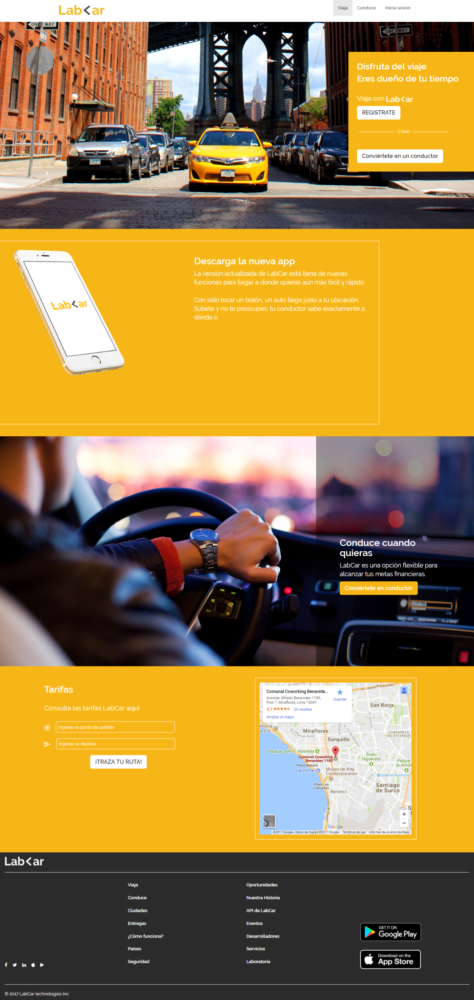

# Reto- LabCar
***

## Objetivo
Recrea la página web de LabCar mediante el framework "Bootstrap" en la version desktop y mobile. 
Además debe de tener los modales de iniciar sesión, regístrate y conviertete en un conductor.

* Version desktop

* Version mobile

## Modales
Se utilizo la herramienta javascript del framework bootstrap.

### Modal Iniciar Sesión

### Modal registrate

### Modal conviertete en conductor

